# Equality, Diversity and Inclusion Vocabulary Hub

Website project by Jake Richards

## Table of Contents

1. [Introduction](#introduction)
2. [Planning](#planning)
3. [Development](#development)
4. [Deployment](#deployment)
5. [Testing](#testing)
6. [Features](#features)
7. [Site Contents](#contents)
8. [Repository & Project Board](#repository)
9. [Sources](#sources)
10. [Reflections](#reflections)

## Introduction

I created EDI Vocab Hub as a website to provide some basic information about Equality, Diversity and Inclusion (EDI) in a way that's accessible for both adults and young people - contextualised into a school setting. 

The website makes use of HTML, CSS, bootstrap and limited JS. It's split into 5 pages with a home page. 

This site is my submission for AI Augmented FullStack Bootcamp HTML/CSS/Bootstrap - Individual Project.

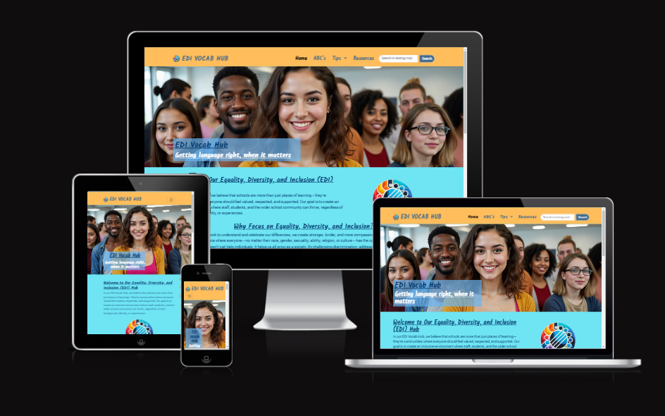

## Planning

### Design & Purpose

I designed this website to be a hub of information to inform others about some of the important vocabulary surrounding EDI, give tips to both staff and students about how to better respect others and celebrate their differences, as well as signpost resources for users to continue their learning journey. 

The website needed to feel clean, not overwhelming with terminology and text from the start, with clear signposting for usage to be understood by both adults and young people. 

I chose the original colours from an early image I found:

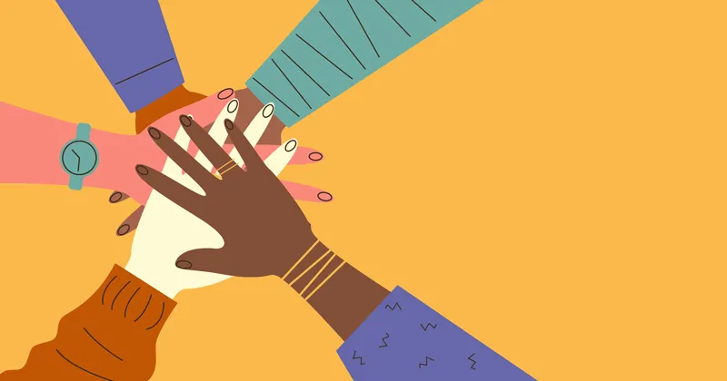

I found the colour palette visually pleasing and could provide sufficient contrast to those with visual impairment (VI).

### User Stories

In line with Agile methodology, I wrote user stories in the planning and development of my website. The full details of these can be found on my project board.

I considered the following perspectives:

- A first-time visitor
- A student seeking more information
- A teacher seeking more information
- A returning visitor
- A VI user/someone using a screen reader

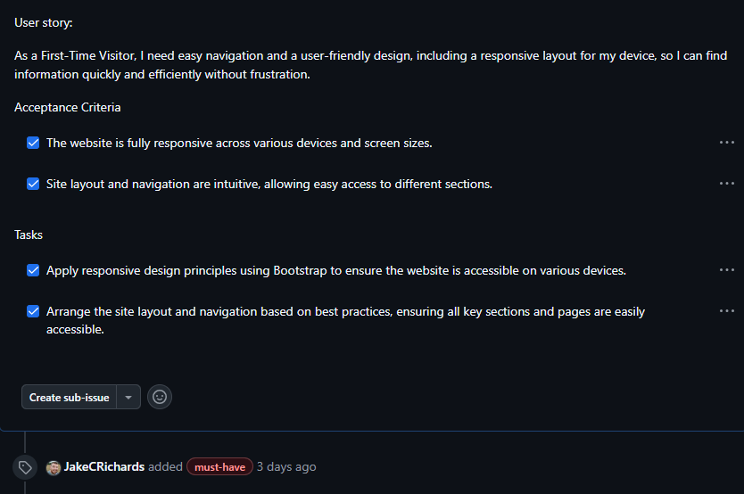

### Project board

A project board was used during development.

[Github Project Board](https://github.com/users/JakeCRichards/projects/5)

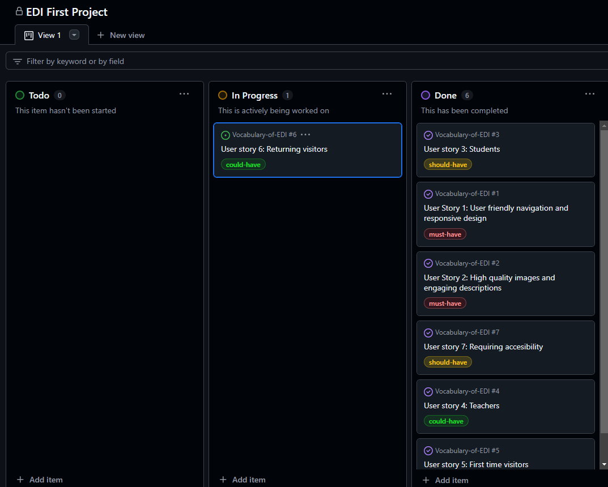

### Wireframe

The website developed from my initial wireframes, with one of the main changes being the splitting of the tips page into two - one for students and one for staff. 

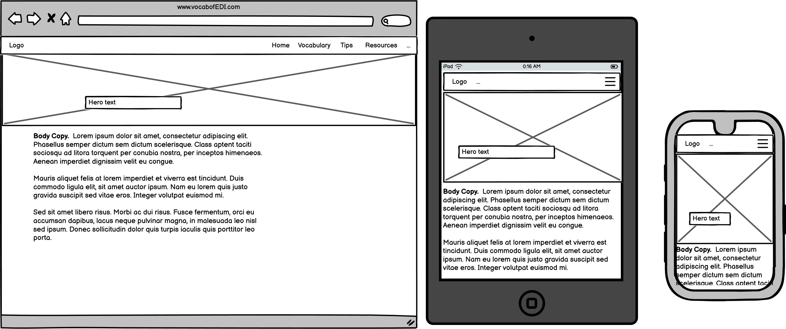
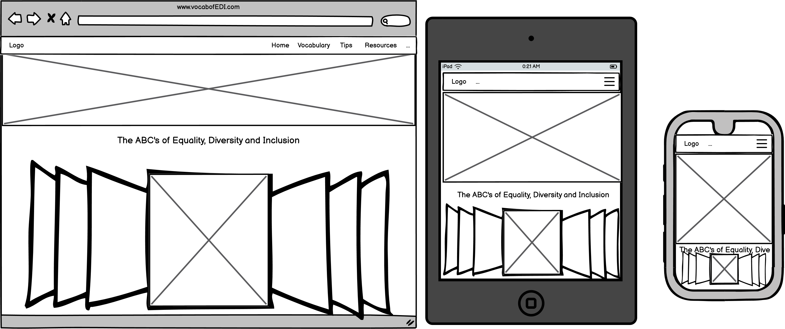
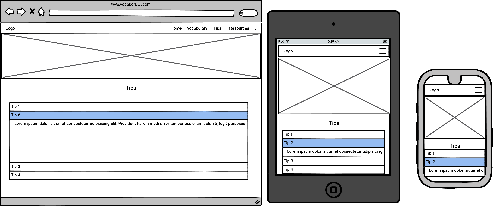
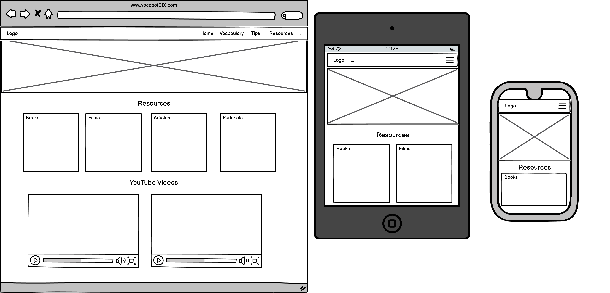

## Development

The website was developed using HTML & CSS with the bootstrap framework.

There was also some JS used to control the Nav Bar and form submission modal.

A project board was set up and used during development.

A github repo was used for version control.

The website uses customisation of styling for the bootstrap classes.

The home page was created first and this was used as template for the other pages. 

An AI (copilot) was used to assist in development. 

## Deployment

The website is deployed to github pages. This is very simple process.

Navigate to your github repo, click settings and navigate to pages. Then you simply select the branch and then save.

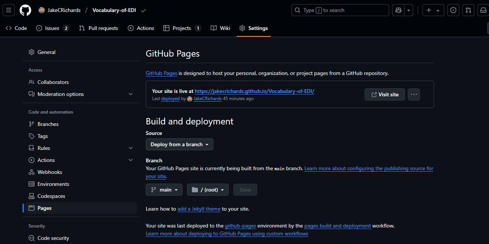

## Testing

The website was thoroughly tested before completion.

- Manual code review to find bugs
- Manual code review to check accessability requirements eg. alt text on images
- Check site with W3S HTML/CSS validator
- All links work and external links open in a new tab
- Manually test site locally. for example, rendering issues, images loading, navigation links, scale at breakpoints, check console for errors in dev tools, etc.
- Manually test hosted site
- Testing with Dev Tools Lighthouse

### Responsiveness

I tested for responsiveness using [Am I responsive?](https://ui.dev/amiresponsive?url=https://jakecrichards.github.io/Vocabulary-of-EDI/)

which generated this image displaying my website across multiple devices:

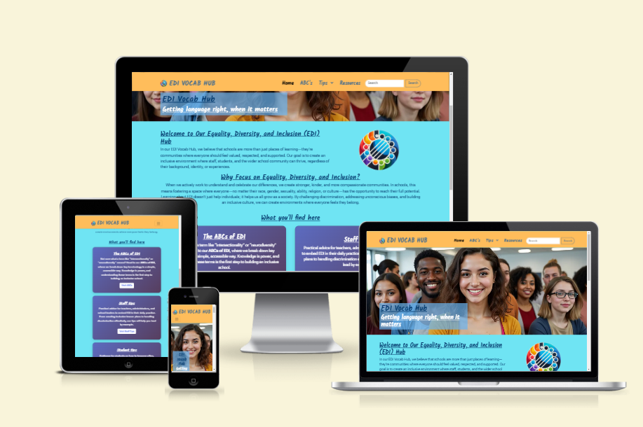

### Validation

- Pass W3s HTML Validator 

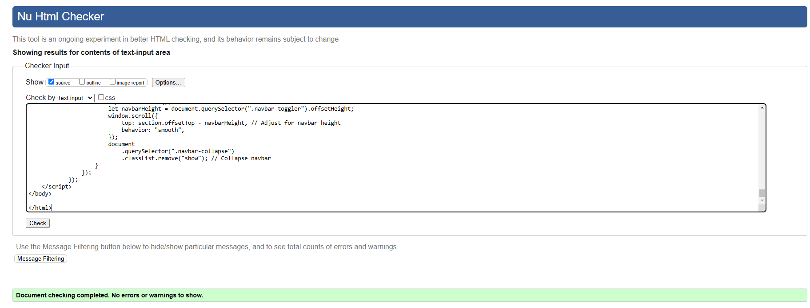
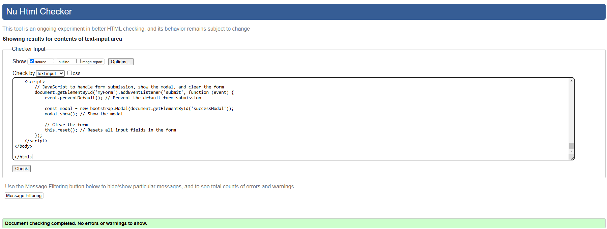

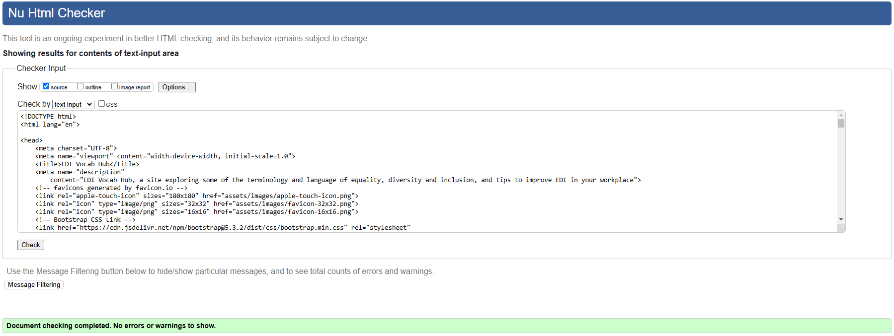
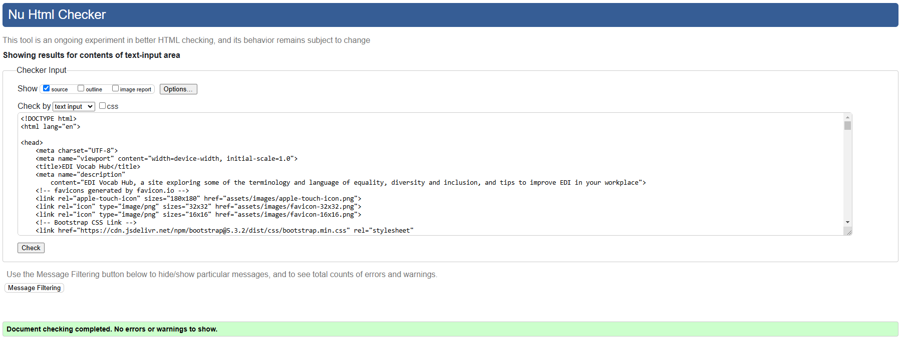

- Pass CSS validator with no errors.
- The only warning came from using variables

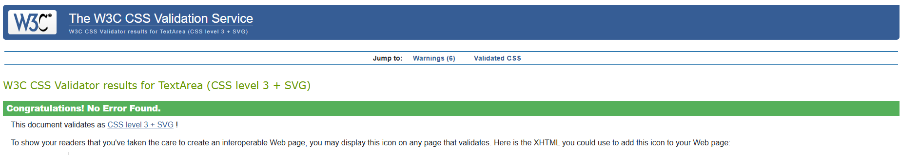

- Score 99 on google lighthouse on desktop mode and 90 on mobile for index.html

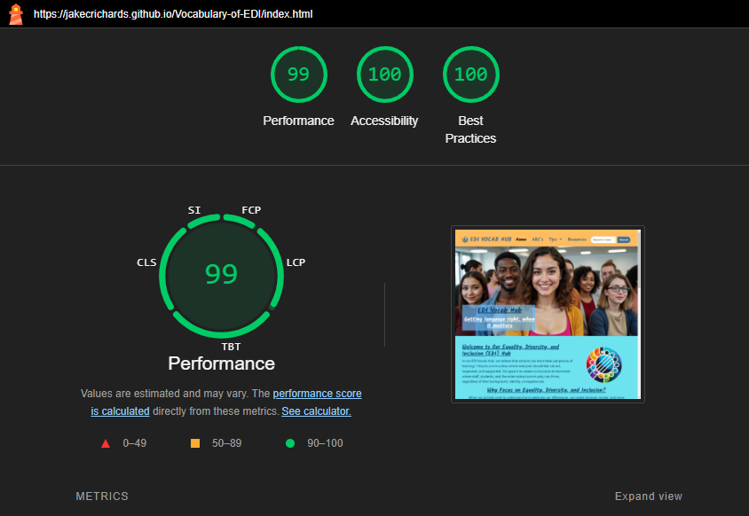
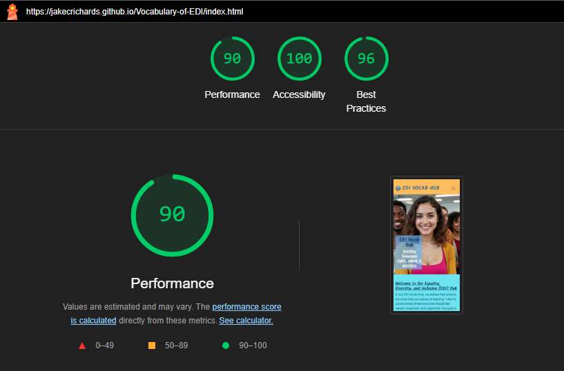

### Known Bugs

At the moment there are no major bugs identified through my testing. 

I am working on developing the search bar function and so have labelled it under development. 

I could potentially improve the hero images on the additional pages by overlaying text onto a background image rather than just utilising an image with embedded text. 

## Features

Carousel - I employed the use of a bootstrap carousel to display a graphic version of the alphabet with each letter representing a different term under the genre of EDI. I felt this was a good way to display a large amount of information in a visually pleasing way.

Accordian - I then employed a bootstrap accordian to give some specific definitions that are important to the context of schools/young people. I chose an accordian because it helped to reduce the appearance of large amounts of text.

Nav Bar - The nav bar is a customised bootstrap nav bar, allowing for easy navigation, a good user experience, and branding.

Cards - I customised bootstrap cards to present chunks on information in a visually pleasing way. 

Embedded YouTube videos - I chose to embed YouTube videos into the tips pages and resources pages rather than writing out large amounts of text or static images. I felt embedding them would improve the user experience rather than just linking away. 

Form - I created a form on the resources page to allow users to submit their own resources to share. In education, much is made of the community sharing resources and this is a feature that many would utilise to help contribute to build up the bank of resources. I chose to make the submission of this a modal confirmation rather than a whole submission page as I didn't want to direct users away from the resources page for them to have to return back again. 

### Technologies used

HTML5

CSS

JS - limited usage

Bootstrap framework

Balsamiq Wireframing

## Contents

All content was written either by myself, or for speed was written by ChatGPT/copilot. 

ChatGPT wrote, through careful prompts, the tips for both students and staff. This was to speed up time on the project.

ChatGPT also contributed towards the definitions in the ABCs, although this was heavily editted by myself to make definitions more appropriately pitched. 

I used the book "An ABC of equality by Chana Ginelle Ewing" to create the carousel. 

## Repository

The Github repo can be found here.

[Github Repo](https://github.com/JakeCRichards/Vocabulary-of-EDI)

The project Board can be found here.

[Github Project Board](https://github.com/users/JakeCRichards/projects/5)

## Sources

All code was either coded by me or suggested by copilot which I then reviewed and decided whether to implement.

One piece of code came from ChatGPT, which was the js for opening the form submission modal as this is currently beyond my technical abilities.

I also used ChatGPT to help generate the favicon image/logo. 

Code Institute provided the js code to automatically close the nav bar.

Colour schemes and ideas for bootstrap cards came from www.bootstrapexamples.com

I also relied heavily upon Bootstrap Documentation to better implement components into my project. 

## Reflections

This project was the first opportunity within coding for me to create something entirely of my own design, to test my skills and abilities, and to see a project through from start to finish. 

I found this to be an enjoyable, if sometimes frustrating project. Most of the time the frustration was caused by a lack of technical skill on my part where I could imagine what i wanted the site to look like but couldn't translate that easily. 

I definitely went beyond the scope of the assignment, mostly through ambition to apply what I've been learning so far. 

Thank you for reading. 

